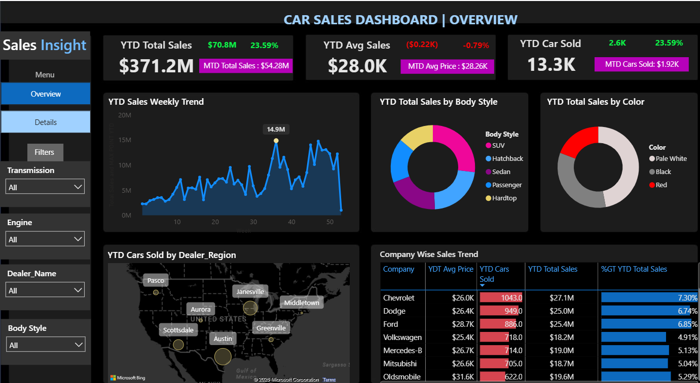

# Car Sales Dashboard

## Project Overview

This project presents an interactive **Car Sales Dashboard** developed using **Power BI**. The dashboard provides insights into car sales performance, sales trends, vehicle characteristics, dealer regions, and company-wise performance.

The objective of this project is to transform raw car sales data into meaningful visual insights that support data-driven decision-making.

---

## Dashboard Preview

## Key Metrics

The dashboard tracks important sales performance indicators, including:

* **YTD Total Sales:** $371.2M
* **YTD Average Sales:** $28.0K
* **YTD Cars Sold:** 13.3K
* **MTD Total Sales:** $54.28M
* **MTD Average Price:** $28.26K
* **MTD Cars Sold:** 1.92K

## Dashboard Analysis

The dashboard provides insights into the following areas:

### YTD Sales Weekly Trend

Analyzes sales performance across different weeks of the year to identify trends and fluctuations in sales.

### Total Sales by Body Style

Compares total sales across different car body styles, including:

* SUV
* Hatchback
* Sedan
* Passenger
* Hardtop

### Total Sales by Color

Analyzes sales distribution based on vehicle colors such as:

* Pale White
* Black
* Red

### Cars Sold by Dealer Region

Visualizes the geographical distribution of cars sold across different dealer locations.

### Company-Wise Sales Trend

Compares different automobile companies based on:

* YTD Average Price
* YTD Cars Sold
* YTD Total Sales
* Percentage Growth in YTD Total Sales

### Interactive Filters

The dashboard includes filters for:

* Transmission
* Engine
* Dealer Name
* Body Style

## Key Insights

* The dashboard provides a year-to-date overview of overall sales performance.
* Sales trends can be analyzed on a weekly basis to identify high and low-performing periods.
* Different vehicle body styles contribute differently to total sales.
* Vehicle color preferences can be analyzed based on sales distribution.
* Dealer regions provide insights into geographical sales performance.
* Company-wise analysis helps compare sales, pricing, and growth across different automobile brands.

## Tools and Technologies Used

* Power BI
* Microsoft Excel / CSV
* DAX
* Data Cleaning
* Data Analysis
* Data Visualization

## How to Use

1. Download or clone this repository.
2. Open the `dashboard` folder.
3. Open `Car_Sales_Dashboard.pbix` using Power BI Desktop.
4. Explore the interactive dashboard using the available filters and visualizations.

## Author

**Nitika Nema**

Aspiring Data Analyst | SQL | Python | Power BI | Tableau | AI
